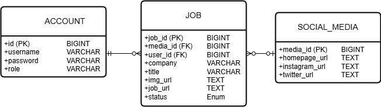
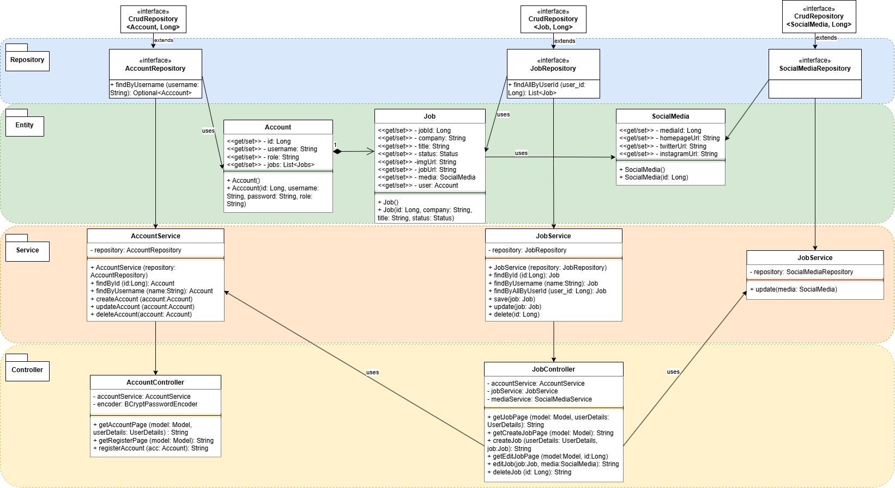
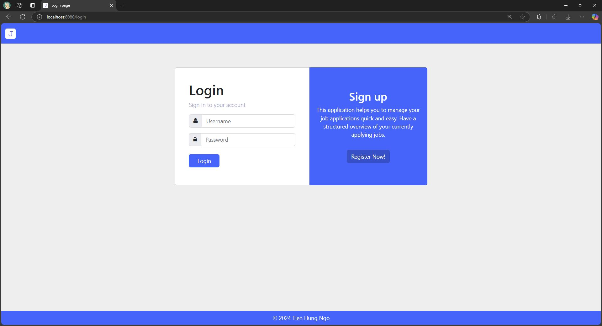
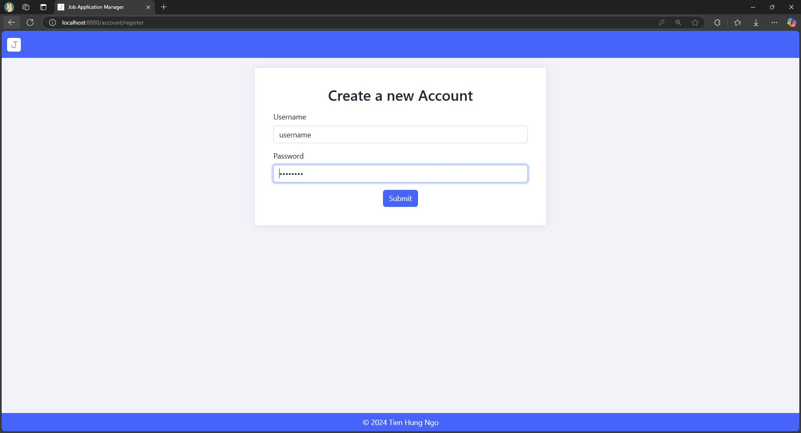
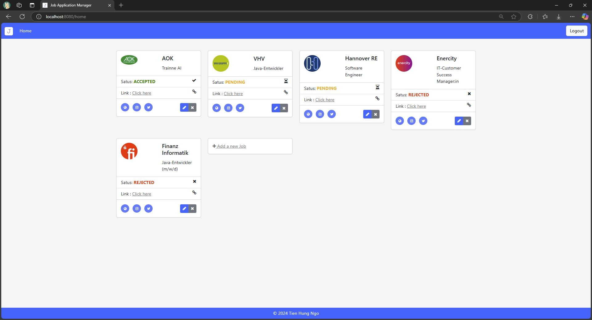
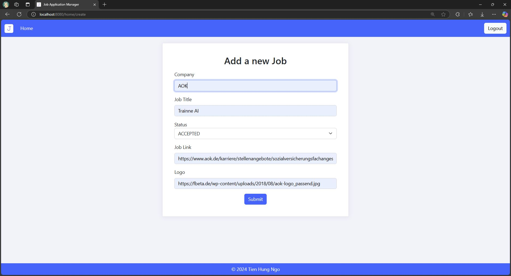
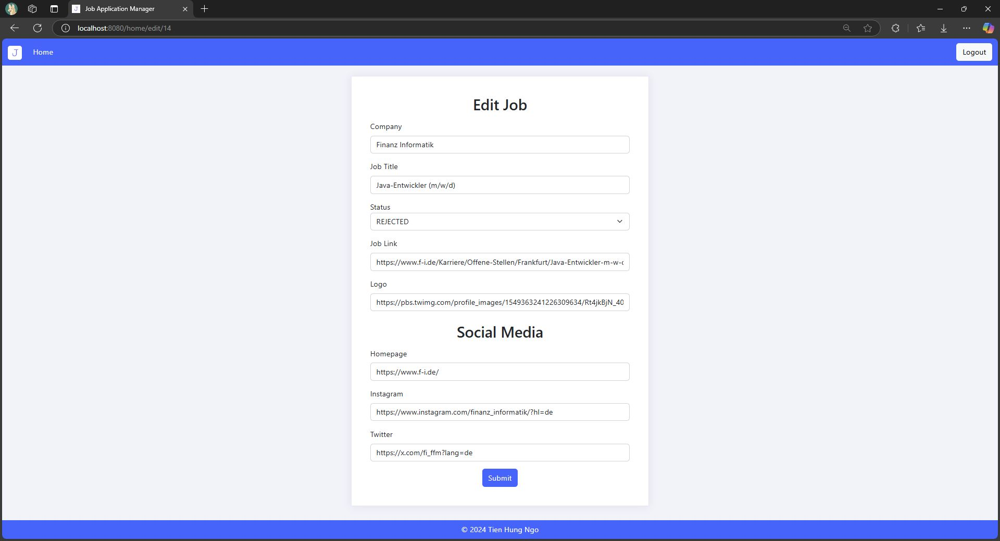

# Job Application Manager

Job application manager project using Java Web with Spring Framework and Thymeleaf.

# Demo

Deployed on render.com via Docker:

- https://jobapplicationdemo.onrender.com/

Response may take up to >50 seconds due to free tier deployment.

- Login:
    - Create Account
    - Or Username: User and Password: password

# Features

- Create, Read, Update, Delete (CRUD)
- Registration
- Login

# Requirements

- Java JDK 1.8
- Maven 4.0.0
- Bootstrap 5.2.3

# Technologies

- Java
- Spring Boot
- Spring Security
- Spring Data JPA
- Maven
- HTML, CSS, Bootstrap
- H2 / MySQL / PostgreSQL
- Thymeleaf

# Installation

```
git clone https://github.com/Hungpai/jobmanager.git
```

Import project or double click on pom.xml to open it with IntelliJ IDEA.
This version uses an in-memory H2 Database which automatically
loads data from src/main/resources/data.sql. The create.sql file contains the
schema, which is automatically generated by JPA.
Run the Spring Boot Application and open the following adress: http://localhost:8080/.

For other persistance providers like MySQL or PostgreSQL adjust the application.properties file under
src/main/resources/ and uncomment the dependancy in pom.xml:

```
<dependency>
    <groupId>com.mysql</groupId>
    <artifactId>mysql-connector-j</artifactId>
    <scope>runtime</scope>
</dependency>
<dependency>
    <groupId>org.postgresql</groupId>
    <artifactId>postgresql</artifactId>
    <scope>runtime</scope>
</dependency>
```

# Unit Tests

Unit tests are available in src/test/java/com/jobmanager/.
Basic CRUD functionality are tested on Account and Job table.

# ER Model

- ACCOUNT <-> Job: 1 Mandatory to Many Optional
- JOB <-> Social_Media: Many Optional to 1 Optional



# UML Diagram

- Operating Logic is divided into a 4 packages: Repository, Entitiy, Service and Controller.
- Separating domain logic from persistance logic using Repository Pattern.



# Screenshots





